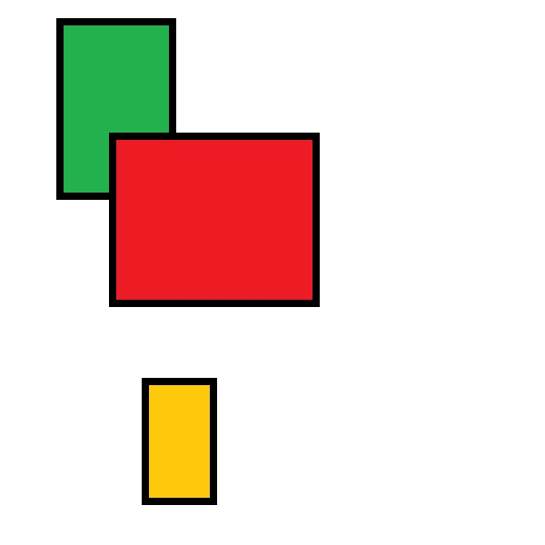
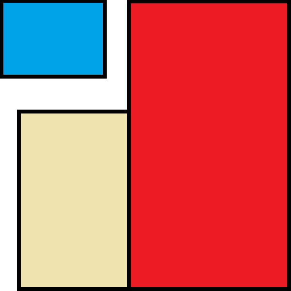

Mondrian Pattern Generator
==========================

Piet Mondrian (7 March 1872 - 1 February 1944) is probably best known for establishing a distinctive visual pattern in our cultural heritage. Its characteristic way of creating images by making subsequent, orthogonal subdivisions has inspired not only fashion designers and confectioners but also [computer scientists](https://github.com/qiyuangong/Mondrian).

[Images from: [Wikimedia Commons](https://commons.wikimedia.org/)]

What you will learn
-------------------

The workshop gives priority to _doing_ rather than _understanding_. Precise instructions will be given without much theoretical background. To do something for the first time is a great experience in itself even if you only have a sketchy picture of what is going on.

This sounds odd for learning a new technology skill where there is a lot of background required, no doubt! There will be plenty of situations that require you to continue without full understanding. However, if you enjoy your first contact with rust you will have the energy and motivation develop your skills further. You will need that motivation! If you are motivated and have patience to reflect on the explanations and to do further practical exercises you will be better of on the long run.

**Bon courage!**

Intro
-----

If you want to make a piece of silicon do what you want you have to give it extremely precise instructions. We call this activity _programming_. In the end, all computers, mobile phones etc. are just wires, silicon and so on.

The first step is to understand the problem in a precise way. The universe is incredibly complex.

+ What am I interested in?

+ What am I _not_ interested in?

+ Which information do I have?

+ Which information do I need?

+ How can I derive or _create_ the information I need based on the information I have.

### The Mondrian Universe

[Image from: [Visuwords (TM)](http://visuwords.com)]

### What to focus on?

**What are we not interested in?** (At least not for our little project here.) His biography. The techniques of painting. And so on.

**What are we interested in?** The paintings of Piet Mondrian. They are oil paintings on canvas. The canvas is made of some fabric (linen) which is a plant... The paint is some colourful substances mixed with oil as a suspension -- We could continue like this for ever.

**What aspect(s) of his paintings are we interested in?** The distinctive visual patterns.

For us as humans, all these things are often immediately clear but for the machines we want to program they are not.

### Mondrian Patterns

What makes this type of pattern _this_ type of pattern?

+ We see the _canvas_ as a rectangular surface that has a colour at each location. Initially it is white or some other more or less uniform colour.

+ The Mondrian Painting is a canvas filled with coloured rectangular areas bounded by black borders.

With this description we certainly make an over-simplification, omitting many aspects of the choices he made regarding composition, geometry, colour... We will see more of the complexity as we proceed.

Nonetheless, this is (still) not precise enough to define the distinctive pattern we are interested in. It could also mean something like [random rectangles](https://williamaadams.wordpress.com/2013/12/12/multitask-ui-like-its-1995/).

Also, although we can discuss what Piet Mondrian considered a "valid" mondrian pattern, for this course we also do not want any of these to be produced:

Up to now, nothing in our _definition_ makes sure the rectangles

+ are aligned with the edge of the canvas,

+ cover the whole canvas,

+ do not overlap, producing non-rectangular remainders.

With _Mondrian Pattern_ we will refer to a rectangular area, the _canvas_, filled _completely_ with differently _coloured rectangles_. The rectangles are oriented 'upright' so that their edges are aligned with the borders of the canvas.

### Processing Mondrian Patterns

To fill a given rectangular _canvas_ with a pattern that satisfies the criteria of the definition we can use these steps:

1. Make vertical/horizontal subdivisions so that rectangular sub-regions emerge.

2. Paint each sub-region with a coloured rectangle and paint a black border around it.

There are other ways of achieving similar or the same type of pattern. Also, we are far from a level of precision that would suit programming a machine to do it. But for us humans, we have gained a lot of precision already.

Practice: "The Workshops"
-------------------------

Each step in the instructions is marked by a &#9654;&#9654;.

### Before you start

&#9654;&#9654; If you have not [set up your machine for coding](https://github.com/rust-community/rustbridge/blob/master/workshops/installfest/user-guide.md) please do so, now.

&#9654;&#9654; Currently (but hopefully this is going to change in the near future), you need `gcc` installed in order to have graphics output available.

TODO: Add link to gcc install instructions as soon as they exist.

### Alternative learning ressources

**If you are a programming newcomer** and if you do not want to (or failed to) set up a computer for coding right now, we suggest to have a look at these alternatives:

+ [rustbyexample.com](http://rustbyexample.com/)

+ [exercism.io](http://exercism.io/languages/rust)

### Setup a first project

Make a new project named `mondpaint`:

&#9654;&#9654; Type `cargo new --bin mondpaint` into the console and hit the `Enter` key.

&#9654;&#9654; Type `cd mondpaint` into the console, and hit the `Enter` key.

#### [Testing]

Create an executable program and execute it:

&#9654;&#9654; Type `cargo run` into the console and hit the `Enter` key.

Your console should now look something like this:

### Part I

This part is dedicated to people with no prior programming experience. Detailed instructions guide learners through minimal interventions in an existing piece of rust code. Each step changes the Mondrian pattern in an important way, in turn providing visual feedback to the learner.

[continue to Part I](part1.md)

### Part II

TODO: The second part is yet to be developed!

It is dedicated to people who have made some more coding experience for themselves, either in rust or in another language.

The mondrian pattern generator follows the idea of rust as a parallel processing systems programming language. Part II will directly address rust-specific concepts related to multi-threading.

--------------------------------------

[Continue to Part I](part1.md)
