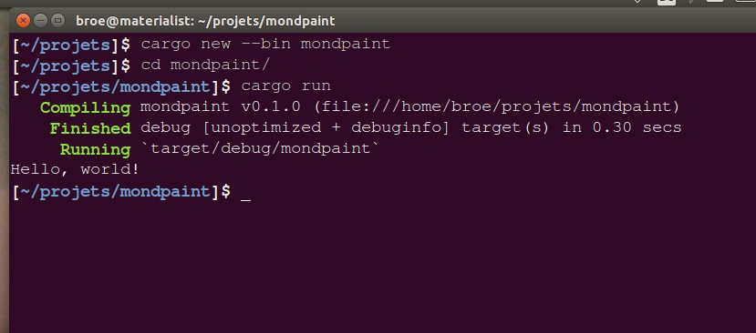
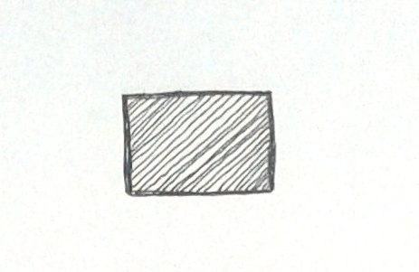
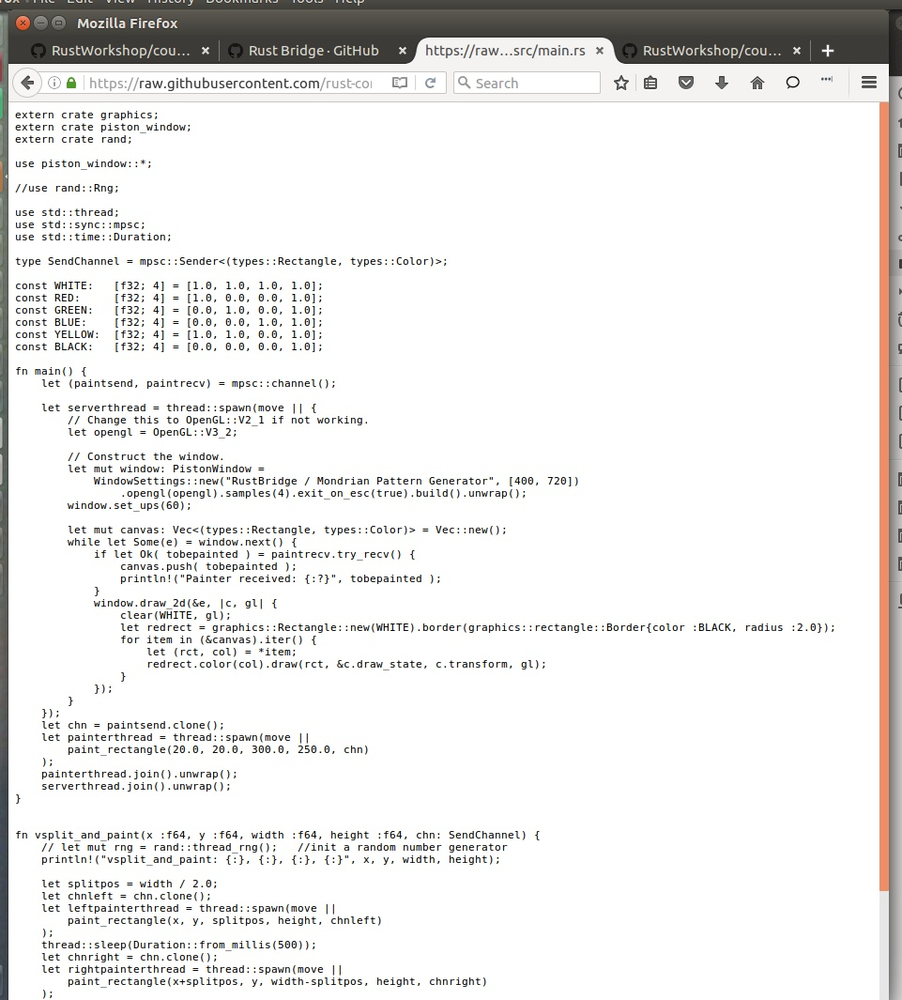
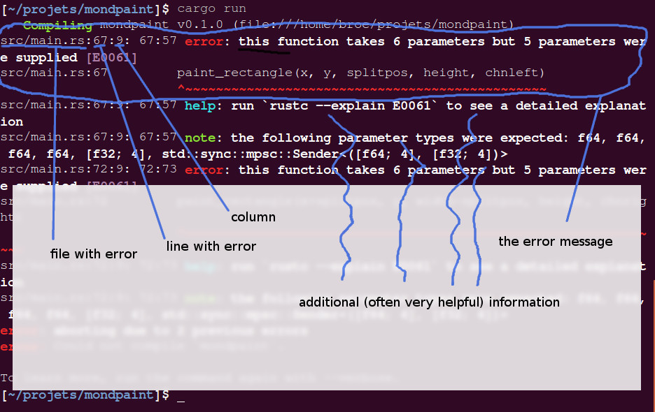
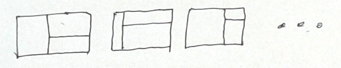
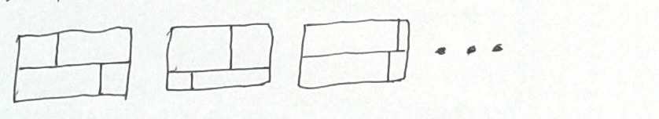

Mondrian Pattern Generator
==========================

<a title="Piet Mondrian [Public domain], via Wikimedia Commons" href="https://commons.wikimedia.org/wiki/File%3ATableau_I%2C_by_Piet_Mondriaan.jpg">
</a>


Piet Mondrian (7 March 1872 - 1 February 1944) is propably best known for establishing a distinctive visual pattern in our cultural heritage. Its characteristic way of creating images by making subsequent, orthogonal subdivisions has inspired not only fasion designers and confectioners but also [computer scientists](https://github.com/qiyuangong/Mondrian).

<a title="By Eric Koch / Anefo (Nationaal Archief) [CC BY-SA 3.0 (http://creativecommons.org/licenses/by-sa/3.0)], via Wikimedia Commons" href="https://commons.wikimedia.org/wiki/File%3AMondriaanmode_door_Yves_St_Laurent_(1966).jpg"></a>
<a title="By Heidi De Vries [CC BY 2.0 (http://creativecommons.org/licenses/by/2.0)], via Wikimedia Commons" href="https://commons.wikimedia.org/wiki/File%3AMondrian_Cake.jpg"></a>

**All Images from:** [Wikimedia Commons](https://commons.wikimedia.org/)


Information Processing
----------------------

The universe is incredibly complex. When it comes to information processing technology, the first step to solving a problem is to understand the problem in a precise way.

+ What am I interested in?

+ What am I _not_ interested in?

+ Which information do I have?

+ Which information do I need?

+ How can I derive or _create_ the information I need based on the information I have.

The mondrian universe
---------------------


**Image from:** [Visuwords (TM)](http://visuwords.com)

Not incredibly complex, yet, too complex and vague for a straight-forward information processing problem.


### What to focus on?


**What are we not interested in?** (At least not for our little project here.) His biography. The techniques of painting. And so on.

**What are we interested in?** The paintings of Piet Mondrian. They are oil paintings on canvas. The canvas is made of some fabric (linen) which is a plant... The paint is some colourful substances mixed with oil as a suspension -- **STOP!** We could continue like this for ever.

**What aspect(s) of his paintings are we interested in?** The distinctive visual patterns. For us as humans, all these things are often immediately clear but for the machines we want to program they are not.


### Mondrian Patterns

What makes this type of pattern _this_ type of pattern?

With this description we will certainly make an over-simplification, omitting many aspects of the choices he made regarding composition, geometry, colour... We will see more of the complexity as we proceed.

+ We see the _canvas_ as a rectangular surface that has a colour at each location. Initially it is white or some other more or less uniform colour.

+ The Mondrian Painting is a canvas filled with coloured rectangular areas bounded by black borders.

This is (still) not precise enough to define the distinctive pattern we are interested in. It could also mean something like [random rectangles](https://williamaadams.wordpress.com/2013/12/12/multitask-ui-like-its-1995/).

Up to now, nothing in our _definition_ makes sure the rectangles

+ are aligned with the edge of the canvas,

+ cover the whole canvas,

+ do not overlap, producing non-rectangular remainders.

TODO: Add more odd examples

With _Mondrian Pattern_ we will refer to a rectangular area, the _canvas_, filled _completely_ with differently _coloured rectangles_. The rectangles are oriented 'upright' so that their edges are aligned with the borders of the canvas.


Processing Mondrian Patterns
----------------------------

We know _what_ we want to achieve but we do not now _how_ we can achieve it.

TODO: Most simple example: One filled Rectangle

TODO: Second most simple example: One Subdivision

TODO: Complex example: More subdivisions


To fill a given rectangular _canvas_ with a pattern that satisfies the criteria of the definition we can use these steps:

1. Make vertical/horizontal subdivisions so that rectangular sub-regions emerge.

2. Paint each sub-region with a coloured rectangle and paint a black border around it.

There are other ways of achieving similar or the same type of pattern. Also, we are far from a level of precision that would suit programming a machine to do it. But for us, we have gained a lot of precision already.


Practice
---------

Each step in the instructions is marked by a &#9654;&#9654;.

### Getting started with coding

Make a new project named `mondpaint`:

&#9654;&#9654; Type `cargo new --bin mondpaint` into the console and hit the `Enter` key.

&#9654;&#9654; Type `cd mondpaint` into the console, and hit the `Enter` key.

&#9654;&#9654; If you have not [set up your machine for coding]( https://github.com/rust-community/rustbridge/blob/master/workshops/installfest/user-guide.md) please do so, now.


#### [Testing]

Create an executable program and execute it:

&#9654;&#9654; Type `cargo run` into the console and hit the `Enter` key.

Your console should now look like this:



### Exercise 0: Start with a prepared minimal mondrian pattern



At this point, you have executed a minimal `Hello World` rust project already!
Now, replace that first project with the minimal mondrian pattern generator:

&#9654;&#9654; Open the files `main.rs` (in the subfolder `src`) and `Cargo.toml` in your text editor.

If you are unsure where to find the files and/or how to open them in a text editor there are [very detailed instructions in Step 2 and 3 here](https://github.com/broesamle/RustWorkshop/blob/master/minimals/countinghands.md#step-2-where-is-the-program).

&#9654;&#9654; Clicking the links will show the file content in the browser window.

+ [new main.rs](https://raw.githubusercontent.com/rust-community/rustbridge/389c0502113503eccae6626561920083959cbe07/workshops/mondrian-pattern/codebase/mondpaint/src/main.rs)

+ [new Cargo.toml](https://raw.githubusercontent.com/rust-community/rustbridge/389c0502113503eccae6626561920083959cbe07/workshops/mondrian-pattern/codebase/mondpaint/Cargo.toml)

What you see looks quite complex and like a foreign language. True, it is rust, the language you will learn now! At this point, you don't need to understand it. You just have to copy and paste it :-)



&#9654;&#9654; Copy and paste it from there into the file in the text editor. (Do it for both files in the same way.)

&#9654;&#9654; Save the files in your editor.

#### [Testing]

&#9654;&#9654; Make sure your machine has an internet connection working.

&#9654;&#9654; To execute the program do again `cargo run`.

Your rust compiler will work for some time now

&#9654;&#9654; Then, see what happens: can you see a very minimal mondrian pattern (a red rectangle with a black frame) in a window?

+ In windows, it happens that the window is hidden behind other open windows.

+ TODO: Fix that!

You should see something similar to this:


Congratulations, you have made a project, adapted it so that it matches an example, and executed it successfully!

#### [Explanation]

Although the mondrian pattern in the window is what we're here for, it is worth looking at the console window as well. Don't worry about the warnings for now. Rust tells us that there are things in the program that are never used. We will use them soon!


### Exercise 1: Make one vertical split


It is now time to have a closer look at the rust code. It is located in `src` folder and the file is `main.rs`.

&#9654;&#9654; Open the file `main.rs` located in folder `src` in your editor.

Most of the code you will never touch. Only the highlighted areas are important for you.


Furthermore, you only need to make tiny modifications at first:

&#9654;&#9654; Look at the upper highlighted area. Change the line <br>`paint_rectangle(20.0, 20.0, 300.0, 250.0, chn)` into <br>`vsplit_and_paint(20.0, 20.0, 300.0, 250.0, chn)`.

#### [Testing]

&#9654;&#9654; To execute the program do again `cargo run`.

Can you see the window open with the two-rectangles-pattern, as given in the sketch?

#### [Snapshot] 1
From time to time there will be such "snapshots": What are the exact changes in the code. The second link gives _a snapshot_ of how the code should look at this point.

[view changes](https://github.com/rust-community/rustbridge/commit/754dc60730f0fd16f6001785aee533128326d6b5)
|
[download main.rs](https://raw.githubusercontent.com/rust-community/rustbridge/754dc60730f0fd16f6001785aee533128326d6b5/workshops/mondrian-pattern/codebase/mondpaint/src/main.rs)

#### Explanation
The line you have changed is the line that _invokes_ the mondrian painting activity. Technically speaking this line tells rust to _invoke an operation_, named `paint_rectangle`. Before, you have changed that line so as to execute a different operation, `vsplit_and_paint`.


### Exercise 2: Split position


Line 64 calculates the position where to split the canvas into two areas: 

```rust
let splitpos = width / 2.0;
```

&#9654;&#9654; Replace the `2.0` with a `3.0`.

#### [Testing] --as usual--

#### [Snapshot] 2
[view changes](https://github.com/rust-community/rustbridge/commit/1dcdf3125943137fb231e9514c73b5136e1206cb)
|
[download main.rs](https://github.com/rust-community/rustbridge/commit/1dcdf3125943137fb231e9514c73b5136e1206cb/workshops/mondrian-pattern/codebase/mondpaint/src/main.rs)

#### Explanation

The first highlighted area, the one you have modified in _Exercise 1_ executes the operation `vsplit_and_paint`. The second highlighted area _defines_ the operations `vsplit_and_paint` and `paint_rectangle`. 
An operation is defined as a sequence of (other) operations to be executed on invocation.

Defining an operation can be compared to writing a recipe, invoking it means to actually prepare the dish _one time_. This can be repeated any number of times even though there is only one definition/recipe.

What you have done in this exercise is to modify the operations that are executed, whenever `vsplit_and_paint` is executed. In this case you changed the ratio between the left and the right side of the split to _one third:two thirds_.


### Exercise 3: Specify the colour for `paint_rectangle`


&#9654;&#9654; Find the lines where `paint_rectangle` is defined:

```rust
fn paint_rectangle(x :f64, y :f64, width :f64, height :f64, chn: SendChannel)
{
    println!("paint_rectangle: {:}, {:}, {:}, {:}", x, y, width, height);
    chn.send( ([x, y, width, height], RED) ).unwrap();
}
```

The stuff in the `( . . . )` is called _parameters_, separated by `,`. Parameters are used to specify the details, how an operation should be executed in detail. This exercise wants to _specify the colour for paint_rectangle_. Here we go!

&#9654;&#9654; Add an extra parameter `c` to the definition of `paint_rectangle` like this:

```rust
fn paint_rectangle(x :f64, y :f64, width :f64, height :f64, c: types::Color, chn: SendChannel)
```

#### Testing

&#9654;&#9654; Save the file.

&#9654;&#9654; `cargo run`

**Bam! Your first rust build-error!**


#### Explanation

They look scary in the beginning!



We added one little thing in the definition of an operation and we get this amount of error!

This is what rust is complaining about: `this function takes 6 parameters but 5 parameters were supplied`. Makes sense. We changed the operation and now it requires more information to be executed: The colour of the rectangle. The error occurs because this information is required by the operation but it is not provided. 

Where should it be given? ...at each point in the code where the execution of `paint_rectangle` is invoked: Lines 67 and 72; exactly the lines where the two (identical) errors are reported. Makes sense.


### Exercise 4: Different colours on each side


The issue encountered in Exercise 3 is that colour information is required on the one hand but not provided. When fixing this, we will (as a side effect) have a Mondrian pattern with different colours on each side!

Where do the error messages direct you?

```
src/main.rs:67:9: 67:57 error: this function takes 6 parameters but 5 parameters were supplied [E0061]
. . .
src/main.rs:72:9: 72:73 error: this function takes 6 parameters but 5 parameters were supplied [E0061]
```
Lines 67 and 73:

```rust
paint_rectangle(x, y, splitpos, height, chnleft)
. . .
paint_rectangle(x+splitpos, y, width-splitpos, height, chnright)
```
Both lines invoke `paint_rectangle` with slightly different parameters.

&#9654;&#9654; In each line, behind the parameter `height`, the colour has to be provided, i.e. like this:

```rust
paint_rectangle(x, y, splitpos, height, RED, chnleft)
. . .
paint_rectangle(x+splitpos, y, width-splitpos, height, BLUE, chnright)
```

#### [Testing]
Testing this via `cargo run` should make rust happy again and it runs the example. Yeah! But both sides are red hmmm.

And the warnings have changed:
```
src/main.rs:17:1: 17:48 warning: constant item is never used: `GREEN`, #[warn(dead_code)] on by default
src/main.rs:17 const GREEN:   [f32; 4] = [0.0, 1.0, 0.0, 1.0];
               ^~~~~~~~~~~~~~~~~~~~~~~~~~~~~~~~~~~~~~~~~~~~~~~
src/main.rs:19:1: 19:48 warning: constant item is never used: `YELLOW`, #[warn(dead_code)] on by default
src/main.rs:19 const YELLOW:  [f32; 4] = [1.0, 1.0, 0.0, 1.0];
               ^~~~~~~~~~~~~~~~~~~~~~~~~~~~~~~~~~~~~~~~~~~~~~~
src/main.rs:78:61: 78:62 warning: unused variable: `c`, #[warn(unused_variables)] on by default
src/main.rs:78 fn paint_rectangle(x :f64, y :f64, width :f64, height :f64, c: types::Color, chn: SendChannel)

```

#### Explanation

Yes, there is still two colours unused, that's fine. But there is an `unused variable`, `c` in line 78.

```rust
fn paint_rectangle(x :f64, y :f64, width :f64, height :f64, c: types::Color, chn: SendChannel)
```

This is the line where you added the new parameter for colour. Rust calls this a _variable_ because parameters are special sorts of variables.
What is a variable? A variable is a container that can carry some value during program execution. To make things easier for you, you can give names to these containers, here `c` for colour. We decided to give `paint_rectangle` some information about the colour to be used and we do that via the parameter variable c.

Rust was happy because all required parameters are now given again. It was happy enough to make and run the program but it was also a bit suspicious because there is c, which is never used (remember the warning).

The last thing we have to adapt the definition of `paint_rectangle` so as to use colour information. We just need to get the information from `c` into the painting of the rectangle. The actual painting of the rectangle is invoked here:
```rust
chn.send( ([x, y, width, height], RED) ).unwrap();
```


&#9654;&#9654; **Final Thing to do:** Replace `RED` with `c` and give it should all be working as planned!

#### [Snapshot] 4

[view changes](https://github.com/rust-community/rustbridge/commit/c24797b80d1f0c9039c722159e137dc531f140fb)
|
[download main.rs](https://github.com/rust-community/rustbridge/commit/c24797b80d1f0c9039c722159e137dc531f140fb/workshops/mondrian-pattern/codebase/mondpaint/src/main.rs)


### Exercise 5: Random split position


This Exercise will give the mondrian painter a bit of 'artistic' (!?!) freedom. It can randomly choose the position of where to split the canvas. You will modify the operation `vsplit_and_paint` to use a random number for the split position.

A coupple of things are already prepared in the example code.
There is an operation for generating random numbers available: For instance, `rng.gen_range(0.0, 20.0)` will produce a random number between `0.0` and `20.0`.

Currently it is deactivated in the example; it is placed in a comment _comment_:
```
// the remainder of a line after a double forward slash will be ignored

/*
Furthermore, everything between 'slash star' and
'star slash' is also ignored, even over multiple lines.
*/
```

&#9654;&#9654; Uncomment lines 7 and 61:

```rust
use rand::Rng;
. . .
let mut rng = rand::thread_rng();   //init a random number generator`.
```

&#9654;&#9654; Run the example in order to know whether rust is still happy with the changes. (It should run as before except for two more warnings, which is not a problem right now.)

From _Exercise 2_ you already know where the split position is calculated.

&#9654;&#9654; Find the relevant line in the code again and replace it with

```rust
let splitpos = rng.gen_range(0.0, width);
```

#### [Testing]
You will have to run the example a couple of times in order to see the different split positions across several runs.

#### Explanation
`vsplit_and_paint` receives a number of parameters which define the position and dimensions of where to paint the mondrian pattern: x, y coordinates of the upper left corner and width and height of the canvas (and the colour and some technical stuff).

It decides on a position where to split the canvas vertically and calculates two smaller areas, left and right of that split so as to fully cover the canvas. Technically speaking, the split position is the width of the left side. The width of the right side is the width of the whole canvas minus the width of the left side. Similar calculations are done for the x position of the right hand part.

The next step is to delegate the two parts to some other operation(s) that will take care of each side. This happens by invoking `paint_rectangle` with according coordinates.

**If you are confused, making a sketch of the subdivision will help you to understand what is going on in detail!**


#### [Snapshot] 5
[view changes](https://github.com/rust-community/rustbridge/commit/30c7b9c62453ab456029ca480e07d7e33b5c0f93)
|
[download main.rs](https://github.com/rust-community/rustbridge/commit/30c7b9c62453ab456029ca480e07d7e33b5c0f93/workshops/mondrian-pattern/codebase/mondpaint/src/main.rs)


### Exercise 6: Horizontal split


You will _define an operation_ that works in the same way as `vsplit_and_paint` except that it does Horizontal splits.

&#9654;&#9654; If you have not made a sketch of the vertical canvas split before, now you will need it.

&#9654;&#9654; You will also need one vor a horizontal split.

&#9654;&#9654; Make a copy of the operation definition of `vsplit_and_paint` and rename it to `hsplit_and_paint`.

&#9654;&#9654; Identify the code lines where the height and the y-coordinates are calculated.

+ this will involve all lines that touch `splitpos`, `width` and `x`

+ `height` and `y` have to be calculated depending on the split position

+ Remember the order of the parameters for `paint_rectangle`: `x, y, width, height, ...`. You have to give the new coordinates in the exact same order!

+ Take some time, it is not trivial!

#### [Testing]
The new operation has to be invoked at some point:

&#9654;&#9654; For testing it, find the spot where `vsplit_and_paint` is invoked and replace it with `hsplit_and_paint`.

&#9654;&#9654; Run the example.


If you get error messages, most likely, you have done smaller errors. Finding and fixing errors is one of the key skills in programming. 

&#9654;&#9654; If you feel adventurous you should try to find them yourself! Otherwise, you might need some smaller advice to continue by yourself.

Copying the snapshot is the last option. If you do so, please take some time to figure out, what is going on!

&#9654;&#9654; Feel free to use more interesting colours :-)

#### [Snapshot] 6
[view changes](https://github.com/rust-community/rustbridge/commit/aae0b114be1d8996f18db88998d4fe0b3c047201)
|
[download main.rs](https://github.com/rust-community/rustbridge/commit/aae0b114be1d8996f18db88998d4fe0b3c047201/workshops/mondrian-pattern/codebase/mondpaint/src/main.rs)


### Exercise 7: Combine split and delegate operations
`paint_rectangle(x, y, splitpos . . .` and `paint_rectangle(x+splitpo, y, . . .`.

It is now time to play with the new operation**s**!

&#9654;&#9654; If you fell adventurous, try to figure out for yourself how to achieve one of the ny patterns.


**In more detail:** Currently, `hsplit_and_paint` triggers `paint_rectangle` for both sides of the split. For the first pattern

&#9654;&#9654; Modify `vsplit_and_paint` so that it triggers `paint_rectangle` on the left side of the split and `hsplit_and_paint` on the right side.

&#9654;&#9654; Don't forget to adapt the initially invoked operation in line 53.



&#9654;&#9654; Modify `hsplit_and_paint` so that it triggers `paint_rectangle` on the left side of the split and `hsplit_and_paint` on the right side.

&#9654;&#9654; Don't forget to adapt the initially invoked operation in line 53.



#### [Snapshot] 7a
[view changes](https://github.com/rust-community/rustbridge/commit/3249caaa11f91b34344999809294c1d05493b597)
|
[download main.rs](https://github.com/rust-community/rustbridge/commit/3249caaa11f91b34344999809294c1d05493b597/workshops/mondrian-pattern/codebase/mondpaint/src/main.rs)

#### [Snapshot] 7b
[view changes](https://github.com/rust-community/rustbridge/commit/e84d28afedec182ac5d1a148f7602ce756c246bd)
|
[download main.rs](https://github.com/rust-community/rustbridge/commit/e84d28afedec182ac5d1a148f7602ce756c246bd/workshops/mondrian-pattern/codebase/mondpaint/src/main.rs)


### Exercise 8: An infinite pattern generation process


**Warning!** You may **crash the program or even your machine** if you continue! Usually, this is not a problem and you can just close the program and/or restart your machine and continue.**

There is one way of achieving this pattern by defining more specific operations. However, things will be much more interesting if you

&#9654;&#9654; Try to modify and recombined the existing operations, only.

&#9654;&#9654; Make a diagram of the pattern you want to achieve. Sketch out step-by-step all the operations that will be invoked and in what order. For example, for the first pattern in Exercise 7 this will be:

* `vsplit_and_paint` invokes for
    * left side: `paint_rectangle`
    * right side: `hsplit_and_paint` invokes for
        * top side: `paint_rectangle`
        * bottom side: `paint_rectangle`

The _split_ operations invoke to others, which actually run in parallel! The pattern painting process is artificially delayed so that you can see that in detail.

#### [Snapshot] 8
[view changes](https://github.com/rust-community/rustbridge/commit/560ef8cf6a9df67151bfa65bdab7a07655fcd77d)
|
[download main.rs](https://github.com/rust-community/rustbridge/commit/560ef8cf6a9df67151bfa65bdab7a07655fcd77d/workshops/mondrian-pattern/codebase/mondpaint/src/main.rs)


### Exercise 9: Avoiding the infinite pattern generation process.

**TODO!!**

#### [Snapshot] 9
[view changes](https://github.com/rust-community/rustbridge/commit/6a51b31a396e7a9200ac21a0cc5ab574915a3b2f)
|
[download main.rs](https://github.com/rust-community/rustbridge/commit/6a51b31a396e7a9200ac21a0cc5ab574915a3b2f/workshops/mondrian-pattern/codebase/mondpaint/src/main.rs)


Beyond this Workshop
--------------------

### Why neighbours should be aware of each other

Avoid unlucky encounters of frames and colours.


TODO: Links to more detailed instructive minimals.
