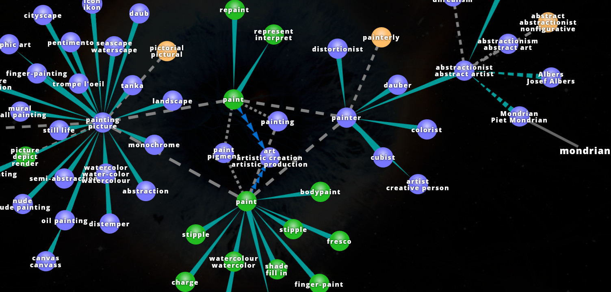
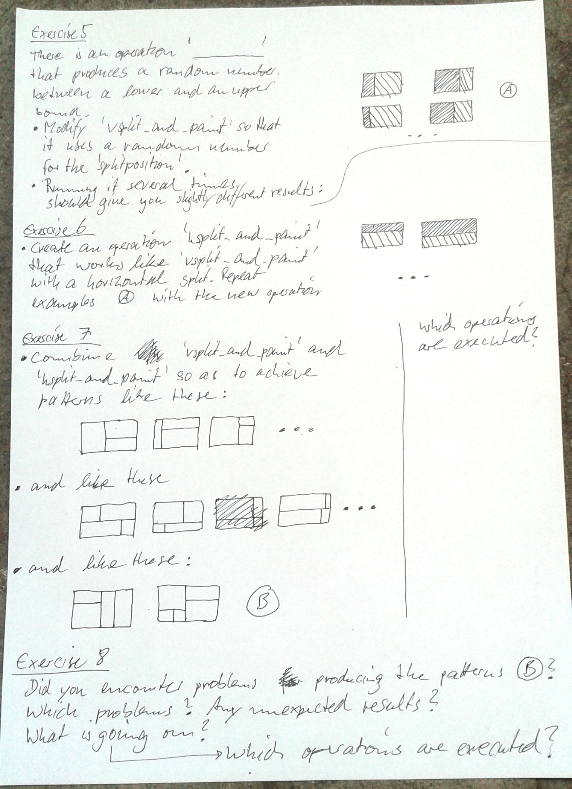

Mondrian Pattern Generator
==========================

Piet Mondrian (7 March 1872 - 1 February 1944) is propably best known for establishing a distinctive visual pattern in our cultural heritage. Its characteristic way of creating images by making subsequent, orthogonal subdivisions has inspired not only fasion designers and confectioners but also [computer scientists](https://github.com/qiyuangong/Mondrian).

**All Images from:** [Wikimedia Commons](https://commons.wikimedia.org/)

Information Processing
----------------------

The universe is incredibly complex. When it comes to information processing technology, the first step to solving a problem is to understand the problem in a precise way.

What am I interested in?
What am I _not_ interested in?
Which information do I have?
Which information do I need?
How can I derive or _create_ the information I need based on the information I have.

The mondrian universe
---------------------

**Image from:** [Visuwords (TM)](http://visuwords.com)

Not incredibly complex, yet, too complex and vague for a straight-forward information processing problem.

### What to focus on?

**What are we not interested in?** (At least not for our little project here.) His biography. The techniques of painting. And so on.

**What are we interested in?** The paintings of Piet Mondrian. They are oil paintings on canvas. The canvas is made of some fabric (linen) which is a plant... The paint is some colourful substances mixed with oil as a suspension -- **STOP!** We could continue like this for ever.

**What aspect(s) of his paintings are we interested in?** The distinctive visual patterns. For us as humans all these things are often immediately clear but for the machines we want to program it is not.

### Mondrian Patterns

What makes this type of pattern _this_ type of pattern?

With this description we will certainly make an over-simplification, omitting many aspects of the choices he made regarding composition, geometry, colour... We will see more of the complexity the further we proceed.

* We see the _canvas_ as a rectangular surface that has a colour at each location. Initially it is white or some other more or less uniform colour.

* The Mondrian Painting is a canvas filled with coloured rectangular areas bounded by black borders.

This is (still) not precise enough to define the distinctive pattern we are interested in. It could also mean something like [random rectangles](https://williamaadams.wordpress.com/2013/12/12/multitask-ui-like-its-1995/).

Up to now, nothing in our _definition_ makes sure the rectangles

* are aligned with the edge of the canvas,
* cover the whole canvas,
* do not overlap, producing non-rectangular remainders.

TODO: Add more odd examples

**Definition:** With _Mondrian Pattern_ we will refer to a rectangular area, the _canvas_, that is filled _completely_ with differently _coloured rectangles_. The rectangles are oriented 'upright' so that their edges are aligned with the borders of the canvas.

Processing Mondrian Patterns
----------------------------

We know _what_ we want to achieve but we do not now _how_ we can achieve it.

TODO: Most simple example: One filled Rectangle

TODO: Second most simple example: One Subdivision

TODO: Complex example: More subdivisions

To fill a given rectangular _canvas_ with a pattern that satisfies the criteria of the definition we can use these steps:

1. Make vertical/horizontal subdivisions so that rectangular sub-regions emerge.
2. Paint each sub-region with a coloured rectangle and paint a black border around it.

There are other ways of achieving similar or the same type of pattern. Also, we are far from a level of precision that would suit programming a machine to do it. But for us, we have gained a lot of precision already.

Exercises
---------

* Make a new project (TODO: link to installfest instructuins)
* Replace main.rs and Cargo.toml with the following starting point (TODO: link)
* Execute the program and make sure you see a minimal mondrian pattern, i.e. a red rectangle.

TODO: finalise instructions as sketched-out here

TODO: **Exercise 9:** Avoiding infinite recursive patterns.

Beyond this Workshop
--------------------

### Why neighbours should be aware of each other

Avoid unlucky encounters of frames and colours.

TODO: Links to more detailed instructive minimals.
